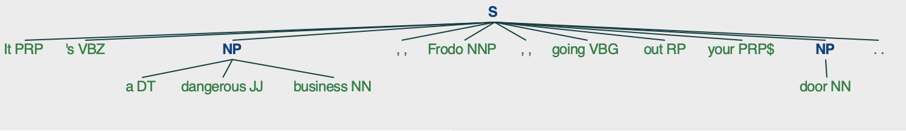

# project_nlp_with_nltk
This repository is trying to explain how to use natural language toolkit in order to do natural language processing

## Table of Contents
* [Docker image](#docker-image)
* [Docker build](#docker-build)
* [Docker run and execute](#docker-run-and-execute)
* [Tokenizing](#tokenizing)
* [Stopwords](#stopwords)
* [Tagging](#tagging)
* [Stemming](#stemming)
* [Lemmatizing](#lemmatizing)
* [Chunking](#chunking)
* [Chinking](#chinking)

## Docker image
First of all we are going to use docker to prepare the environment.

This is the Dockerfile were we can see how to install python and library nltk.
```sh
FROM ubuntu:latest

COPY . /tmp/

RUN apt-get update && \
    apt-get install -y python3 && \
    apt-get install -y python3-pip && \
    pip3 install nltk && \
    python3 -m nltk.downloader all
```


## Docker build
We need to create the docker image in order to launch / execute the code. This is the way to create the docker image
```sh
docker build -t python_nlp_nltk .
```


## Docker run and execute
Now we are able to use the image with the next command
```sh
docker run -it python_nlp_nltk /bin/bash
```


## Tokenizing
Tokenizing is spliting a text in sentences or in words.

Tokenizing by sentence: "nltk_sentence_tokenize.py"
```python
import nltk

input = """At eight o'clock on Thursday morning Arthur didn't feel very good.
            My cat is beautiful.
            I love my car."""

for sentence in nltk.sent_tokenize(input):
    print(nltk.word_tokenize(sentence))
```

How to execute:
```sh
python3 nltk_sentence_tokenize.py 
```

Output:
```sh
['At', 'eight', "o'clock", 'on', 'Thursday', 'morning', 'Arthur', 'did', "n't", 'feel', 'very', 'good', '.']
['My', 'cat', 'is', 'beautiful', '.']
['I', 'love', 'my', 'car', '.']
```


Tokenizing by word: "nltk_sentence_tokenize.py"
```python
import nltk

input = """At eight o'clock on Thursday morning Arthur didn't feel very good.
            My cat is beautiful.
            I love my car."""

tokens = nltk.word_tokenize(input)

print(tokens)
```

How to execute:
```sh
python3 nltk_sentence_tokenize.py 
```

Output:
```sh
['At', 'eight', "o'clock", 'on', 'Thursday', 'morning', 'Arthur', 'did', "n't", 'feel', 'very', 'good', '.', 'My', 'cat', 'is', 'beautiful', '.', 'I', 'love', 'my', 'car', '.']
```


## Stopwords
Now we are going to tokenize a text and remove some stops words from it. Stop words are words that you want to ignore, so you filter them out of your text when you’re processing it. Very common words like 'in', 'is', and 'an' are often used as stop words since they don’t add a lot of meaning to a text in and of themselves.

```python
import nltk

stoplist = set(nltk.corpus.stopwords.words('english'))
print("List of stopwords in English:")
print(stoplist)

text = '''
In computing, stop words are words which are filtered out before or after 
processing of natural language data (text). Though "stop words" usually 
refers to the most common words in a language, there is no single universal 
list of stop words used by all natural language processing tools, and 
indeed not all tools even use such a list. Some tools specifically avoid 
removing these stop words to support phrase search.
'''
print("\nOriginal string:")
print(text)
clean_word_list = [word for word in text.split() if word not in stoplist]
print("\nAfter removing stop words from the said text:")
print(clean_word_list)
```

How to execute:
```sh
python3 nltk_corpus_stopwords.py
```

Output
```sh
List of stopwords in English:
{'myself', 'for', "you'd", 'them', 'wouldn', 'am', 'so', 'himself', 'isn', 'me', 'his', 'i', 'all', 'those', 'down', 'where', "hasn't", 'she', 'that', 'after', 'under', "she's", 'ourselves', 'who', 'if', 'than', 'a', 'this', 'some', 'just', 's', 'are', 'haven', 'only', "needn't", "isn't", 'itself', 'into', 'too', 'until', 'above', 'below', "mustn't", 'hadn', 'or', 'does', 'there', 'm', 'wasn', 'between', 'out', 'my', 'more', 'd', 'o', 'hers', 'whom', 'the', 'because', "you'll", 'nor', 'how', 'again', 'having', 'before', 'further', 'other', 'couldn', 'needn', 'over', 'don', 'from', 'any', 'each', 'can', 'ma', 'at', "won't", 'have', 'yours', "haven't", 'shouldn', 'll', "doesn't", 'as', "shouldn't", 'up', 'is', 'was', 're', 'its', 'be', 'about', 'and', 'why', 'same', 'being', 'with', 'while', 'not', 'to', 'ours', 'both', 'you', 'against', 'weren', 'they', 'an', 'didn', "you've", 'her', 'did', 'he', 'mightn', 've', "wouldn't", 'but', 'such', 'yourselves', 't', 'by', 'y', 'what', 'when', "mightn't", 'few', "wasn't", 'their', 'theirs', "you're", "weren't", 'very', "didn't", 'our', 'through', 'mustn', 'had', 'then', "aren't", 'yourself', "couldn't", 'hasn', "shan't", 'themselves', 'herself', "hadn't", 'here', 'doing', 'aren', 'were', "that'll", 'in', 'should', 'doesn', "should've", 'been', 'now', 'we', 'off', 'own', 'during', "it's", "don't", 'your', 'shan', 'most', 'it', 'on', 'has', 'no', 'ain', 'of', 'do', 'him', 'once', 'these', 'will', 'which', 'won'}

Original string:

In computing, stop words are words which are filtered out before or after 
processing of natural language data (text). Though "stop words" usually 
refers to the most common words in a language, there is no single universal 
list of stop words used by all natural language processing tools, and 
indeed not all tools even use such a list. Some tools specifically avoid 
removing these stop words to support phrase search.


After removing stop words from the said text:
['In', 'computing,', 'stop', 'words', 'words', 'filtered', 'processing', 'natural', 'language', 'data', '(text).', 'Though', '"stop', 'words"', 'usually', 'refers', 'common', 'words', 'language,', 'single', 'universal', 'list', 'stop', 'words', 'used', 'natural', 'language', 'processing', 'tools,', 'indeed', 'tools', 'even', 'use', 'list.', 'Some', 'tools', 'specifically', 'avoid', 'removing', 'stop', 'words', 'support', 'phrase', 'search.']
```   


## Tagging
Part of speech is a grammatical term that deals with the roles words play when you use them together in sentences. Tagging parts of speech, or POS tagging, is the task of labeling the words in your text according to their part of speech.


```python
import nltk

sentence = """At eight o'clock on Thursday morning Arthur didn't feel very good."""

tokens = nltk.word_tokenize(sentence)

print(tokens)

tagged = nltk.pos_tag(tokens)

print(tagged)
```

How to execute:
```sh
python3 nltk_tag_tokens.py
```

Output
```sh
['At', 'eight', "o'clock", 'on', 'Thursday', 'morning', 'Arthur', 'did', "n't", 'feel', 'very', 'good', '.']
[('At', 'IN'), ('eight', 'CD'), ("o'clock", 'NN'), ('on', 'IN'), ('Thursday', 'NNP'), ('morning', 'NN'), ('Arthur', 'NNP'), ('did', 'VBD'), ("n't", 'RB'), ('feel', 'VB'), ('very', 'RB'), ('good', 'JJ'), ('.', '.')]
```   


## Stemming
Stemming is a text processing task in which you reduce words to their root, which is the core part of a word. For example, the words “helping” and “helper” share the root “help.” Stemming allows you to zero in on the basic meaning of a word rather than all the details of how it’s being used. NLTK has more than one stemmer, but you’ll be using the Porter stemmer.

```python
from nltk.stem import PorterStemmer
from nltk.tokenize import word_tokenize

stemmer = PorterStemmer()

string_for_stemming = """
The crew of the USS Discovery discovered many discoveries.
Discovering is what explorers do."""

words = word_tokenize(string_for_stemming)

print("Words: ")
print(words)

stemmed_words = [stemmer.stem(word) for word in words]

print("Stemmed Words: ")
print(stemmed_words)
```

How to execute:
```sh
python3 nltk_stemming.py
```

Output
```sh
Words: 
['The', 'crew', 'of', 'the', 'USS', 'Discovery', 'discovered', 'many', 'discoveries', '.', 'Discovering', 'is', 'what', 'explorers', 'do', '.']
Stemmed Words: 
['the', 'crew', 'of', 'the', 'uss', 'discoveri', 'discov', 'mani', 'discoveri', '.', 'discov', 'is', 'what', 'explor', 'do', '.']
```   


## Lemmatizing
Lemmatizing reduces words to their core meaning.

Example with a word:
```python
from nltk.stem import WordNetLemmatizer

lemmatizer = WordNetLemmatizer()

print("Lemmatizing scarves:")
print(lemmatizer.lemmatize("scarves"))
```

How to execute:
```sh
python3 nltk_lemmatizing_word.py
```

Output
```sh
Lemmatizing scarves:
scarf
```  

Example with a sentence:
```python
from nltk.stem import WordNetLemmatizer
from nltk.tokenize import word_tokenize

lemmatizer = WordNetLemmatizer()
string_for_lemmatizing = "The friends of DeSoto love scarves."

words = word_tokenize(string_for_lemmatizing)
lemmatized_words = [lemmatizer.lemmatize(word) for word in words]

print("Sentence:")
print(string_for_lemmatizing)
print("Lemmatizing sentence:")
print(lemmatized_words)
```

How to execute:
```sh
python3 nltk_lemmatizing_sentence.py
```

Output
```sh
Sentence:
The friends of DeSoto love scarves.
Lemmatizing sentence:
['The', 'friend', 'of', 'DeSoto', 'love', 'scarf', '.']
```

## Chunking
While tokenizing allows you to identify words and sentences, chunking allows you to identify phrases.

```python
from nltk.tokenize import word_tokenize
from nltk import pos_tag
from nltk import RegexpParser
from nltk import Tree

sentence = "I have a very nice car. My car is a ferrari and it is red. I will never buy a Porche."

print("Sentence: ")
print(sentence)

words = word_tokenize(sentence)
print("Words of the sentence: ")
print(words)

words_pos_tags = pos_tag(words)
print("Word pos tag: ")
print(words_pos_tags)

grammar = "NP: {<DT>?<JJ>*<NN>}"
chunk_parser = RegexpParser(grammar)
tree = chunk_parser.parse(words_pos_tags)
tree.draw()
```

How to execute:
```sh
python3 nltk_chunking.py
```

Output
```sh
Sentence: 
I have a very nice car. My car is a ferrari and it is red. I will never buy a Porche.
Words of the sentence: 
['I', 'have', 'a', 'very', 'nice', 'car', '.', 'My', 'car', 'is', 'a', 'ferrari', 'and', 'it', 'is', 'red', '.', 'I', 'will', 'never', 'buy', 'a', 'Porche', '.']
Word pos tag: 
[('I', 'PRP'), ('have', 'VBP'), ('a', 'DT'), ('very', 'RB'), ('nice', 'JJ'), ('car', 'NN'), ('.', '.'), ('My', 'PRP$'), ('car', 'NN'), ('is', 'VBZ'), ('a', 'DT'), ('ferrari', 'NN'), ('and', 'CC'), ('it', 'PRP'), ('is', 'VBZ'), ('red', 'JJ'), ('.', '.'), ('I', 'PRP'), ('will', 'MD'), ('never', 'RB'), ('buy', 'VB'), ('a', 'DT'), ('Porche', 'NNP'), ('.', '.')]
```

You can see the result with the image generated


## Chinking